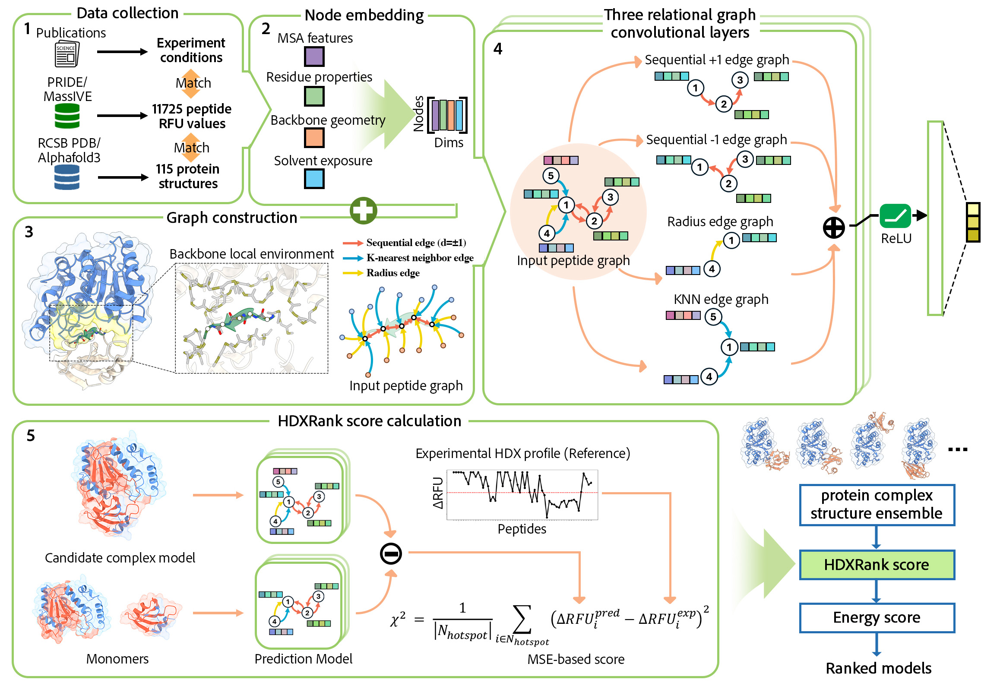

# HDXRank [](https://doi.org/10.5281/zenodo.15426072)
**HDXRank is an open-source pipeline to apply HDX-MS restraints to protein-protein complex prediction ranking.**

## Method overview:

Integrating sparse experimental data into protein complex modeling workflows can significantly improve the accuracy and reliability of predicted models. Despite the valuable insights that hydrogen-deuterium exchange (HDX) data provide about protein binding interfaces, there is currently no standard protocol for incorporating this information into the complex model selection process. Inspired by advances in graph-based deep learning for protein representation, we utilize it as a backbone for a flexible scoring framework in protein-protein complex model ranking based on their alignment with experimental HDX profiles. It offers a robust, HDX-informed selection protocol with improved prediction accuracy.

## Installation:
This program is designed to run in a Python environment compatible with CUDA 11.8. For reproducibility and ease of setup, we recommend using a Docker container to simulate the original environment. Alternatively, the required dependencies can be installed directly via Conda.

1. Clone the repository:
```bash
git clone https://github.com/SuperChrisW/HDXRank.git
cd HDXRank
```
2. (Optional) Use Docker for Reproducibility:
```
# Pull a CUDA-compatible image
docker pull pytorch/pytorch:2.0.0-cuda11.7-cudnn8-runtime

# Launch the container with the current directory mounted
docker run -it --rm -v $(pwd):/workspace -w /workspace pytorch/pytorch:2.0.0-cuda11.7-cudnn8-runtime /bin/bash
```
3. Install Dependencies:
```bash
chmod +x ./install.sh
./install.sh
conda activate HDXRank
python main.py --help
```
This should print the command-line help for the main program, confirming that all dependencies are correctly installed.

## Preparation
* HDXRank requires multiple sequence alignments in `.hhm` format, which are generated using HHblits. Follow the steps below to install HHblits, download the UniRef30 database, and run the alignment.
1. Create hhblits environment
```bash
conda create -n hhblits -y
source activate hhblits
conda install hhsuite -c conda-forge -c bioconda -y
```
2. Download UniRef30 database
```bash
mkdir -p databases
cd databases
wget -O UniRef30_2020_06_hhsuite.tar.gz http://wwwuser.gwdg.de/~compbiol/uniclust/2020_06/UniRef30_2020_06_hhsuite.tar.gz
tar -xvfz UniRef30_2020_06_hhsuite.tar.gz
rm UniRef30_2020_06_hhsuite.tar.gz
cd ..
```
3. Run hhblits to Generate `.hhm` Files
Use `hhblits.sh` script provided in the `HDXRank/` directory to perform multi-sequence alignment 
```bash
bash hhblits.sh
```
All `.fasta` files located in `/HDXRank/fasta_files` will be searched and the resulting `.hhm` files will be saved to `/HDXRank/hhm_files`

* (Optional) To reproduce HDXRank examples or re-train model, you will need the HDX-MS dataset and example files available from Zenodo: [](https://doi.org/10.5281/zenodo.15426072)
```bash
wget -O dataset.zip https://zenodo.org/records/15426072/files/dataset.zip?download=1
unzip dataset.zip

wget -O example.zip https://zenodo.org/records/15426072/files/example.zip?download=1
unzip example.zip

rm dataset.zip example.zip
```
This will create `dataset/` and `example/` directories under the `HDXRank/` root folder.

## Getting Started
To run HDXRank, you will need the following input files:

1. **Protein structure file** (`.pdb`)  
2. **MSA file** (`.hhm`)  
3. **HDX-MS file** (`.xlsx`)  

Additionally, a settings file (`.xml`) is used to define the configuration and control the execution pipeline.
### Example Usage 
We provide ready-to-use examples for ranking docking models and AlphaFold (AF) predictions in the `example/` directory, as demonstrated in our publication.

To run HDXRank using one of the example configurations, execute:
```bash
python main.py -input ./example/1UGH_docking/BatchTable_1UGH.xml
```
This will run the HDX prediction and ranking pipeline based on the specified `.xml` configuration. You may modify the XML file to suit your input files and experimental setup.

### Workflow:

1. **Protein embedding**: HDXRank extracts embeddings from `.pdb` and `.hhm` files.  
2. **Protein graph construction**: Constructs a protein graph from the `.pdb` file.
3. **Peptide graph splitting**: Splits the protein graph into peptide graphs based on the provided HDX-MS `.xlsx` file.

### Execution:
Once all required input files are prepared, you can launch the HDXRank pipeline using the following command:
```bash
python main.py -input [input.xml]
```
By default, the RFU prediction results will be saved to the `output/` directory (can be modified in `.xml` file).

### Post-processing:
After the prediction step completes, run the post-processing scripts located in the `scripts/` directory to compute HDXRank scores for docking models or AlphaFold predictions.

## Merge data and Retrain the model:
HDXRank model was trained upon a curated HDX-MS dataset collected from public database PRIDE and MassIVE, up to March 2024. New HDX-MS data can be merged with the current dataset and used to re-train our model.

To merge the newly collected data to dataset:
1. **copy HDX-MS file into `dataset/HDX_files/`**: the table should contain columns `protein` `state` `start` `end` `sequence` `log_t` `RFU`.
2. **update record file `dataset/250110_HDXRank_dataset.xlsx`**: record all `protein+state` pairs and corresponding structures.
3. **run HDXRank to generate embedding and peptide graphs**:
```bash
python main.py -input ./settings/BatchTable_setting.xml
```

To re-train the HDXRank model:
```bash
python HDXRank_train.py -input ./settings/BatchTable_setting.xml -save ./models
```

## Citing HDXRank
If you utilize HDXRank in your research, please cite the following publication:

```bibtex
@article{Wang2025HDXRank,
  author    = {Liyao Wang, Andrejs Tucš, Songting Ding, Koji Tsuda and Adnan Sljoka},
  title     = {HDXRank: A Deep Learning Framework for Ranking Protein Complex Predictions With Hydrogen–Deuterium Exchange Data},
  journal   = {Journal of Chemical Theory and Computation},
  year      = {2025},
  doi       = {10.1021/acs.jctc.5c00175}
}

